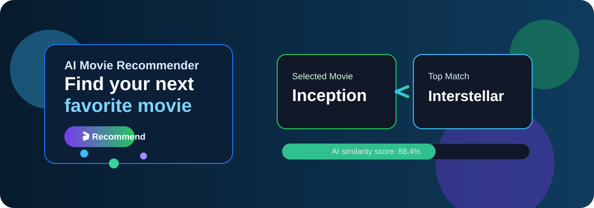
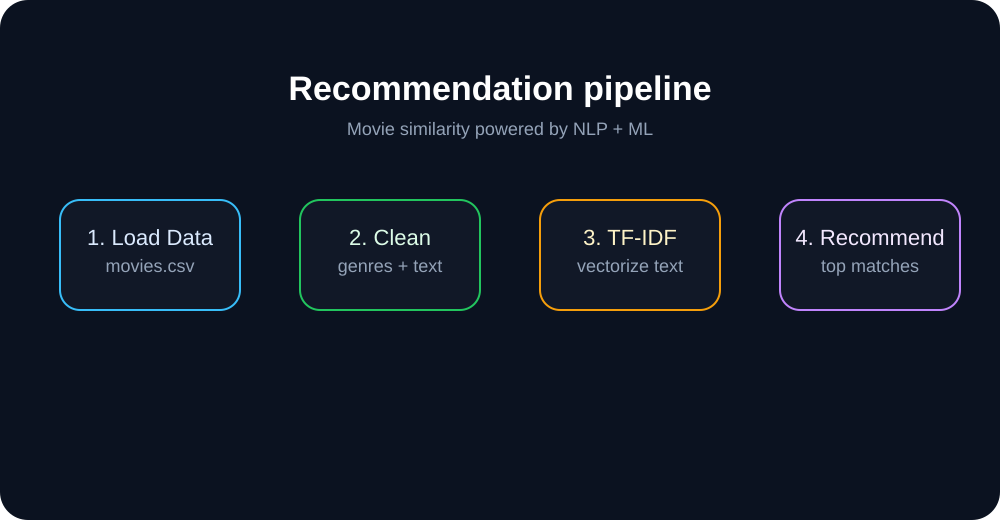

# 🎬 AI Movie Recommender

<p align="center">
  
</p>

<p align="center">
  
  
  
  
</p>

A simple AI-powered movie recommendation system that suggests movies based on a selected movie, using machine learning, natural language processing, and content-based filtering.

## ✨ What this project does

- Recommends movies similar to a chosen movie
- Uses movie genres and descriptions for suggestions
- Gives a friendly and interactive web interface with Streamlit
- Works well as a beginner-friendly ML and NLP project

## 🧠 How the recommendation works

1. Load movie data from a CSV file
2. Combine important fields like genres and overview
3. Convert movie text into numerical vectors using TF-IDF
4. Measure similarity with cosine similarity
5. Show the most relevant movies to the user

<p align="center">
  
</p>

## 🚀 Features

- Interactive movie selector
- Adjustable number of recommendations
- Similarity score display
- Clean and beginner-friendly UI
- Content-based filtering approach

## 🗂️ Project structure

```text
Ai-movie-recommender/
├── app.py
├── README.md
├── requirements.txt
├── assets/
│   ├── hero.svg
│   └── recommendation-flow.svg
├── data/
│   └── .gitkeep
└── .gitignore
```

## 🛠️ Step-by-step setup

### 1) Clone the project

```bash
git clone https://github.com/rammaddilety1-ctrl/Ai-movie-recommender.git
cd Ai-movie-recommender
```

### 2) Create a virtual environment

```bash
python -m venv venv
```

On Windows:

```bash
venv\Scripts\activate
```

On macOS/Linux:

```bash
source venv/bin/activate
```

### 3) Install dependencies

```bash
pip install -r requirements.txt
```

### 4) Prepare the dataset

Create a `data/` folder and place your movie dataset in it as `movies.csv`.

Your CSV should include at least these columns:

- `title`
- `genres`
- `overview`

Example:

```csv
title,genres,overview
Inception,Science Fiction, A thief who steals corporate secrets through dream-sharing technology.
The Dark Knight,Action, Batman fights to save Gotham from a criminal mastermind.
```

### 5) Run the app

```bash
streamlit run app.py
```

Then open the local URL shown in the terminal, usually:

```text
http://localhost:8501
```

## 📌 Example workflow

1. Select a favorite movie from the dropdown
2. Choose how many recommendations you want
3. Click the recommendation button
4. View the top related movies and similarity percentages

## 🔧 Main app logic

The app uses:

- `TfidfVectorizer` for text vectorization
- `cosine_similarity` to compare movie descriptions
- Streamlit for the interactive UI

## ✅ Requirements

```text
streamlit
pandas
scikit-learn
```

## 📚 Notes

This project is a great beginner example of:

- Machine learning
- Natural language processing
- Recommendation systems
- Content-based filtering

If you want, you can expand it with:

- popularity-based filtering
- collaborative filtering
- user login and saved preferences
- movie posters and ratings
- deployment to Streamlit Cloud or Render

---

Made with Python, ML, and a little movie magic 🎬✨

